Este documento describe un modelo dinámico de cambio de cobertura para el estado de Yucatán, desarrollado en el marco de modelación DinamicaEGO. Es un modelo dinámico que cambia anualmente aplicando dos formas generales de cambiar la cobertura, expandir parches existentes y crear nuevos parches (functores expander y patcher). Estos functores expanden o crean nuevos parches basados en dos probabilidades, una general que se aplica a todas las celdas (matriz de transición) y otra que se aplica heterogéneamente en el territorio (pesos de evidencia). La matriz de transición se puede calcular directamente a partir de la cobertura del territorio, mientras que los pesos de evidencia requieren capas geográficas adicionales, estas capas adicionales suelen contener información sobre aspectos que influyen en el cambio de cobertura. En este modelo se utilizaron como capas adicionales las capas de aptitud del territorio para cada sector productivo, que se crearon en el proceso de actualización del Ordenamiento Ecológico del Territorio del Estado de Yucatán.

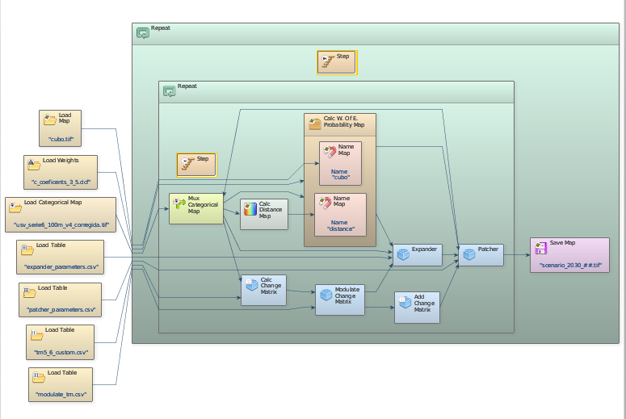

Figura 2: Modelo markoviano (DinamicaEGO)

Estudios previos muestran la capacidad de DinamicaEGO para modelar el cambio de uso de suelo en función de multiples factores espaciales (Cheng y col., 2020; Yi y col., 2012). En términos prácticos DinamicaEGO ofrece herramientas para calcular tanto la matriz de transición como los pesos de evidencia, sin embargo los functores expander y patcher requieren información estadística sobre los nuevos parches como el área promedio, la varianza y la isometría para cada tipo de transición y DinamicaEGO no cuenta con módulos para calcular estas estadísticas. El área promedio y la varianza por tipo de tran- sición se pueden calcular con una combinación de códigos de Python que corren en QGIS y códigos en R, mientras que la isometría se puede obtener en un proceso de calibración.

En las secciones 2 y 3 se describen los reporte_cambio_cobertura/figuras/modelo.pngcálculos de la matriz de transición y los pesos de evidencia dentro de DinamicaEGO, las secciones 4 y 5 describen la metodología para obtener la información sobre la distribución del área de los nuevos parches y el proceso de calibración para obtener la isometría y

finalmente la sección 6 describe el modelo ya calibrado y los escenarios que produce.

**Matriz de transición**

Lamatrizdetransiciónesunacuantificacióndelaproporcióndeceldasquecambiaronacadadistinta categoría y representa la probabilidad de que siendo de una categoría cambie a cada una de las otras categorías. DinamicaEGO proporciona un módulo para calcular la matriz de transición a partir de una capa inicial y una capa final.

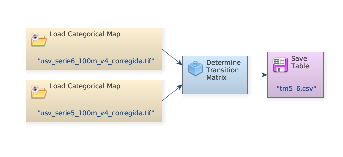

Figura 3: Modelo en DinamicaEGO para calcular la matriz de transición

Para nuestro caso se utilizaron la series 5 y 6 de uso de suelo y vegetación de INEGI,que correspon- den a los años de 2011 y 2014 respectivamente, con una reclasificación que considera 8 categorías. El resultado del modelo que se ilustra en la figura 2, es un archivo en formato csv que contiene la matriz de transición en el formato de análisis de redes:

Tabla 1: Matriz de transición

Tabla 2: Categorías de cobertura From To Rate

Categoría Descripción

PAGE4

2 4 0:00135

2 9 0:01131

7 2 0:00016

7 4 0:00003

7 9 0:00023

9 2 0:02972

9 4 0:00064

11 2 0:00625

11 4 0:00253

11 9 0:00969

1 Acuícola

2 Agropecuario

4 Asentamiento humano

6 Cuerpo de agua

7 Manglar,petén,tular e hidrófila 9 Selva

11 Sin vegetación

PAGE

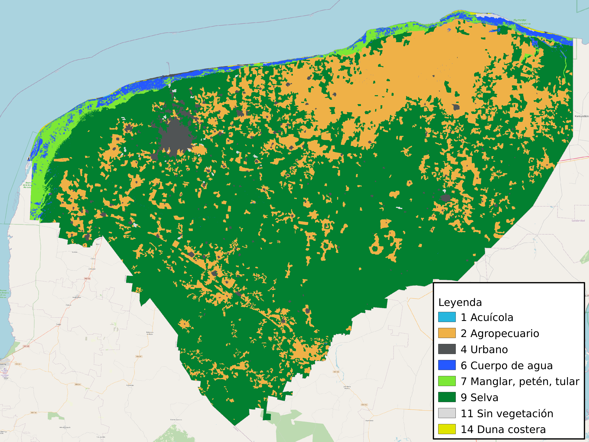

1) Serie 5 (2011)

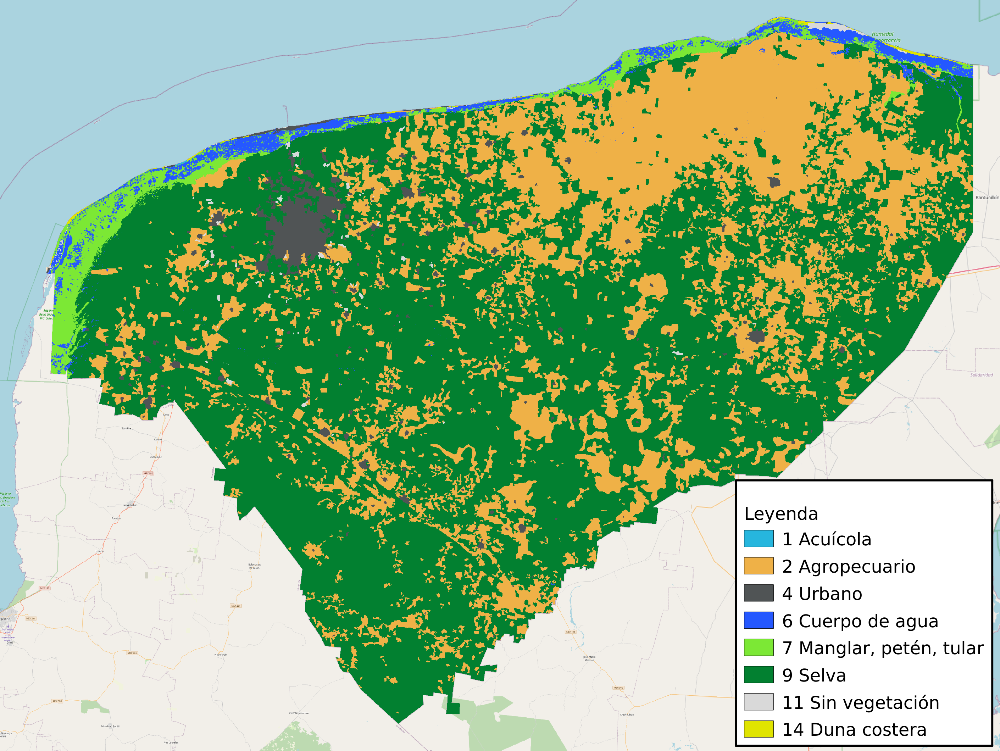

2) Serie 6 (2014)

Figura 4: Series 5 y 6 de uso de suelo y vegetación de INEGI, re-clasificadas.

**Pesos de evidencia**

Los pesos de evidencia es un método Bayesiano que es usado tradicionalmente por geólogos para identificar áreas potenciales para fenómenos geológicos como la mineralización y la sismicidad (Ag- terberg, 1992). DinamicaEGO implementa una adaptación de este método para calcular las relaciones empíricas de variables espaciales.

**Preparación de capas adicionales**

Para utilizar el módulo de DinamicaEGO que sirve para calcular los pesos de evidencia, es necesario preparar un cubo, es decir, un raster multibanda con las capas adicionales, que en nuestro caso son las capas de aptitud para los sectores productivos. Estas capas fueron creadas en el contexto de la actualiza- ción del Ordenamiento Ecológico Territorial del Estado de Yucatán en 2021. Las aptitudes del territorio que se consideraron fueron: porocino-avícola, bovino, minería, milpa maya, industrial, turismo, pesca, forestal, conservación, apicultura, agricultura, acuacultura, urbano y energía renovable.

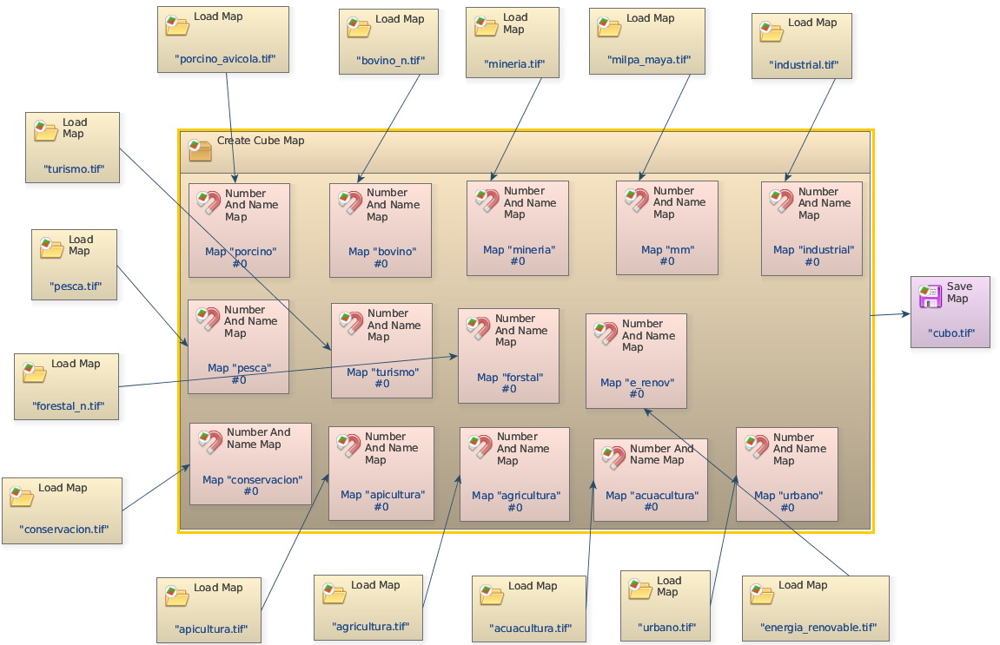

Figura 5: Modelo en DinamicaEGO para ensamblar el cubo con las capas adicionales

2. **Rangos de los coeficientes**

En el caso de que las capas adicionales sean de variables continuas, se requiere establecer los cortes para categorizarlas antes de calcular los pesos de evidencia. La figura 6 mu[estra](#_page6_x56.69_y49.18) el modelo en Dinami- caEGO para calcular estos rangos. El resultado es un archivo con terminación dcf, que será el insumo para descartar correlaciones entre las capas y para obtener los coeficientes de evidencia.

Figura 6: Modelo en DinamicaEGO para calcular los rangos de los pesos de evidencia

3. **Correlación**

Una de las ventajas del método de pesos de evidencia es que el efecto de cada capa geográfica puede calcularse independientemente. La única suposición que se requiere es que las capas adicionales sean espacialmente independientes. Esta prueba se puede realizar por medio de un módulo de DinamicaE- GO que compara por pares las capas adicionales mediante el Coeficiente de Cramers, el Coeficiente de Contingencia y la Incertidumbre Informativa Conjunta (Bonham-Carter, 1994). Como resultado de estas pruebas, si algún par de capas resultan correlacionadas se puede eliminar alguna de las dos o combinar entre ellas.

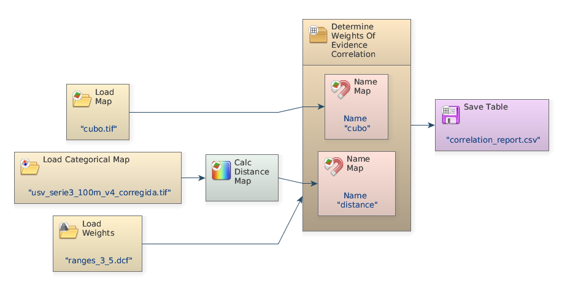

Figura 7: Modelo en DinamicaEGO para generar un reporte de correlaciones

Los resultados muestran que no hay correlaciones suficientemente altas para justificar suprimir capas del cubo y por lo tanto del procedimiento para obtener los pesos de evidencia.

4. **Coeficientes de evidencia**

En el último paso para obtener los pesos de evidencia se utilizan los rangos obtenidos anteriormente en conjunción con el cubo de capas adicionales. La figura 8 muestra el modelo en DinamicaEGO que lo hace.

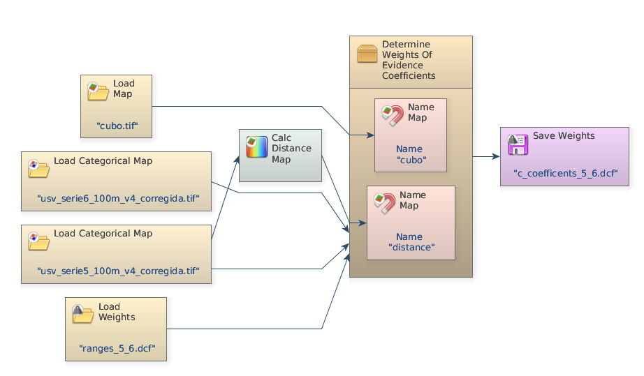

Figura 8: Modelo en DinamicaEGO para calcular los pesos de evidencia

4. **Análisis de parches**

Esta sección describe el procedimiento externo al entorno de DinamicaEGO que se puede seguir para obtener el tamaño promedio de parche nuevo y la varianza de este tamaño. El procedimiento a grandes rasgos consiste en aislar las celdas que cambiaron de categoría, agruparlas por contigüidad, separarlas por tipo de transición, obtener sus áreas y finalmente calcular el promedio y la varianza para cada tipo de transición.

1. **Extracción de parches nuevos**

Para la extracción de parches nuevos se desarrolló un código de Python en QGIS que además de separar los grupos nuevos de celdas de cada categoría, les adiciona la información necesaria para pos- teriormente computar las estadísticas para cada tipo de transición, es decir, el área del grupo de celdas y la categoría mayoritaria de la que cambiaron. El código que implementa este procedimiento se puede descargar en: [https://github.com/serranoycandela/dinamica_ego_yucatan/blob/main/patch_analysis/ separate_patches_all.py](https://github.com/serranoycandela/dinamica_ego_yucatan/blob/main/patch_analysis/separate_patches_all.py)

El resultado es una carpeta con capas vectoriales para cada tipo de transición, estas capas vectoriales contienen los objetos espaciales, así como los datos asociados a este (área, categoría previa, contigüidad con un parche previo).

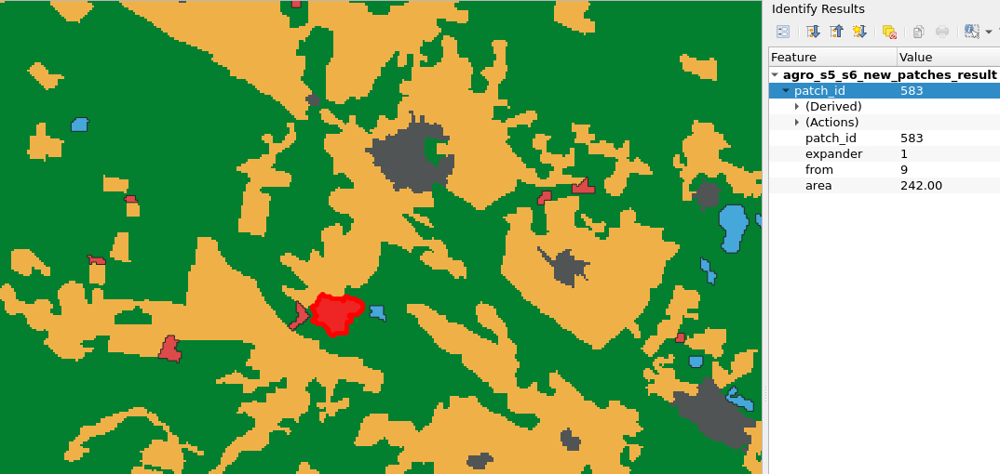

Figura 9: Parches agropecuarios nuevos en QGIS

2. **Proporción de parches disconexos**

Una vez preparadas las capas vectoriales, se procede a obtener las estadísticas usando el lenguaje de programación R. Los archivos vectoriales producidos en el paso anterior se componen de varios archivos, uno de ellos es la tabla con los datos de los objetos espaciales, es un archivo con terminación dbf. Los archivos dbf se pueden leer directamente en el entorno de R y una vez ahí, calcular la proporción de cada transición que sucede contiguo a un parche previo, estos datos se guardan en un archivo csv que alimentará tanto el análisis de isometría como la generación de escenarios futuros. El código que imple- menta este procedimiento se puede descargar en: [https://github.com/serranoycandela/dinamica_ego_ yucatan/blob/main/patch_analysis/patch_stats_1985_2014.R](https://github.com/serranoycandela/dinamica_ego_yucatan/blob/main/patch_analysis/patch_stats_1985_2014.R)

3. **Cálculo de estadísticas de parches**

Los archivos vectoriales producidos en el paso anterior se componen de varios archivos, uno de ellos es la tabla con los datos de los objetos espaciales, es un archivo con terminación dbf. Los archivos dbf se pueden leer directamente en el entorno de R y una vez ahí, calcular las estadísticas necesarias es decir, el tamaño promedio de un nuevo parche y la varianza de este tamaño, para cada tipo de transición. El có- digo que implementa este procedimiento se puede descargar en: [https://github.com/serranoycandela/ dinamica_ego_yucatan/blob/main/patch_analysis/patch_stats_1985_2014.R.Elresult](https://github.com/serranoycandela/dinamica_ego_yucatan/blob/main/patch_analysis/patch_stats_1985_2014.R)adodeestescript son archivos csv en el formato que se requieren para los functores patcher y expander en DinamicaEGO.

5. **Calibración de la isometría**

El valor de la isometría para cada tipo de transición es utilizado por los functores patcher y expan- der para controlar el grado de compacidad que tendrán los nuevos parches. En términos prácticos en DinamicaEGO se utiliza como un factor que multiplica la probabilidad local a la hora de agregar nue- vas celdas a un parche que se está creando. Por esta razón no existe una forma analítica de calcular la isometría, por lo que se requiere encontrar el valor óptimo para la isometría a través de un proceso de calibración.

1. **Simulaciones variando la isometría**

Para encontrar el valor óptimo se requiere probar el modelo para distintos valores de la isometría y comparar estas simulaciones con una capa observada, en nuestro caso conseguimos eso partiendo de la serie 5 de uso de suelo y vegetación de INEGI y comparando los resultados de las simulaciones con la serie 6. Dado que el modelo es estocástico en el sentido de que se basa en probabilidades y cada vez que se corre produce resultados distintos, se corrieron 20 simulaciones para cada valor de la isometría, con el propósito de comparar cada una de estas simulaciones con la capa esperada y luego promediar estas comparaciones. Los valores que para la isometría fueron [0,0.1,0.2,...,1.9,2].

DinamicaEGO guarda las rutas a las capas de insumos como rutas relativas, es decir que buscará a partir de la carpeta donde se encuentra guardado un modelo, por lo que si se copia un modelo de una carpetaaotraenlamismametacarpeta,DinamicaEGOautomáticamenteencontrarálosinsumosnecesa- rios para correr el modelo. Aprovechando ese hecho se implementó un script de Python que crea carpetas para cada valor de la isometría y copia el mismo modelo a todas las carpetas, variando únicamente el va- lor de la isometría. El código que implementa este procedimiento se puede descargar en: [https://github. com/serranoycandela/dinamica_ego_yucatan/blob/main/isometry_analysis/create_run_folders.py](https://github.com/serranoycandela/dinamica_ego_yucatan/blob/main/isometry_analysis/create_run_folders.py)

2. **Determinación de la isometría óptima**

Una vez creadas las carpetas con sus respectivos modelos, se corrieron todas las simulaciones y se procedióahacerlascomparacionesconloesperado,pararealizarlascomparacionesseutilizóunmódulo deDinamicaEGOquecalculalasimilituddelasdiferenciasyrequierelascapasinicialyfinalyelresultado de una simulación específica. Se aplicaron estás comparaciones para las 20 simulaciones de cada una de

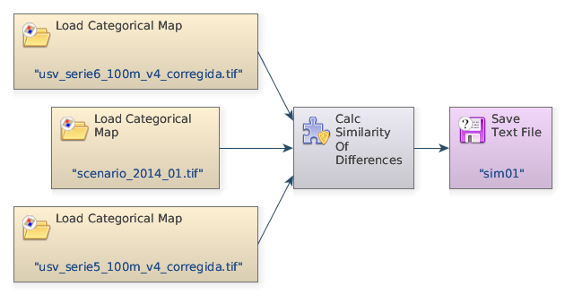

Figura 10: Modelo en DinamicaEGO para calcular similitud de las diferencias

las 21 isometrías probadas, es decir un total de 420 simulaciones y sus respectivas comparaciones con lo esperado. La figura [11 m](#_page10_x56.69_y49.18)uestra los resultados de estas comparaciones. Con lo cual podemos concluir que la isometría óptima es 1.0, y tomaremos ese valor para generar escenarios tendenciales.

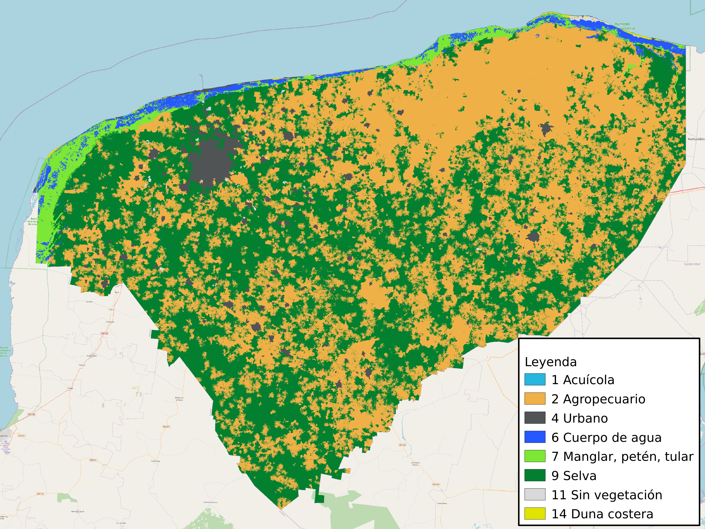

Figura 11: Diagrama de caja de la similitud de las diferencias por valor de isometría

6. **Escenario tendencial**

Figura 12: Modelo en DinamicaEGO para generar escenarios tendenciales

Una vez encontrado el valor óptimo para la isometría, se generaron escenarios tendenciales para el año 2030. Es importante hacer notar que el modelo es estocástico en el sentido de que se basa en probabilidades de transición y cada escenario producido será único. Por esta razón se generaron 10 escenarios tendenciales con los mismos parámetros. El modelo en DinamicaEGO que produce estos esce- narios se muestra en la figura 12[ y ](#_page10_x56.69_y458.72)está disponible en: [https://github.com/serranoycandela/dinamica_ ego_yucatan/blob/main/escenarios_2030/allocate_change_2030_anual.egoml.](https://github.com/serranoycandela/dinamica_ego_yucatan/blob/main/escenarios_2030/allocate_change_2030_anual.egoml)

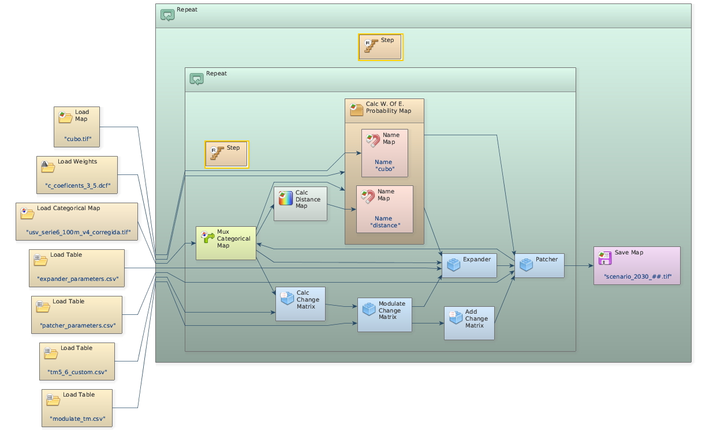

Figura 13: Una de las repeticiones del escenario tendencial 2030

Finalmente en la figura 13 se muestra una de las 10 repeticiones realizadas con el modelo tendencial. Por razones de capacidad de almacenamiento los resultados finales no se incluyeron en el repositorio, sin embargo están disponibles en la carpeta de trabajo que se entrega con este documento. En todos los escenarios tendenciales es evidente que la mayor transformación del territorio en los próximos años, de no tomarse medidas preventivas, será la perdida de selva en favor de la agricultura y la ganadería.

Con este modelo tendencial listo, se pueden generar escenarios tendenciales corriendo el mode- lo sin modificarlo. Para correr el modelo es suficiente instalar DinamicaEGO y copiar la carpeta /FO- MIX/fmx\_dinamica\_ego/escenarios\_2030, que se encuentra en el sistema de almacenamiento remoto del área de Planeación Colaborativa. Esta carpeta contiene todos los insumos para correr el modelo y los archivos csv que se describen en la tabla 3, [así](#_page12_x56.69_y49.18) como el modelo mismo, que es el archivo termina- ción .egoml y que se corre en DinamicaEGO. DinamicaEGO está disponible para los sistemas operati- vos Microsoft Windows, GNU / Linux, y Aple MacOS en la siguiente url: [https://csr.ufmg.br/dinamica/ dinamica-5/](https://csr.ufmg.br/dinamica/dinamica-5/)

Tabla 3: Archivos que modifican el resultado del modelo

Nombre Descripción

expander\_parameters.csv El tamaño promedio y varianza de parche nuevo contiguo a

un parche previo de la misma categoría, por tipo de transi-

ción. Y la isometría por tipo de transición. patcher\_parameters.csv El tamaño promedio y varianza de parche nuevo no contiguo

a un parche previo de la misma categoría, por tipo de transi-

ción. Y la isometría por tipo de transición. tm5\_6\_custom.csv Proporciones de cambio esperadas por tipo de transición. modulate\_tm.csv Proporción de los cambios esperados contiguos y no conti-

guos, por tipo de transición.

Para generar escenarios alternativos, se pueden modificar los archivos csv que se describen en la tabla [3, ](#_page12_x56.69_y49.18)o modificar alguno de los functores del modelo mismo para editar el número de iteraciones o para generar un número distinto de repeticiones.

**Agradecimientos**

El presente estudio se realizó con financiamiento del CONACYT y del Gobierno del Estado de Yu- catán, en el proyecto **Sistema de conocimiento para la gestión del Ordenamiento Ecológico del Territorio del estado de Yucatán.** (2018-2022) Proyecto FOMIX YUC-2018-04-01-88958. *Responsable: Dr. Luis A. Bojórquez Tapia*.

Adicionalmente se agradece la colaboración del M. en C. Rodrigo García Herrera, para correr la calibra- ción del modelo en el cluster de supercómputo del LANCIS.

**Referencias**

Agterberg, F. P. (1992). Combining indicator patterns in weights of evidence modeling for resource

evaluation. *Nonrenewable Resources*, *1*(1), 39-50. [https://doi.org/10.1007/BF01782111 ](https://doi.org/10.1007/BF01782111)Bonham-Carter, G. F. (1994). CHAPTER 8 - Tools for Map Analysis: Map Pairs. En G. F. Bonham-Carter

(Ed.), *Geographic Information Systems for Geoscientists* (pp. 221-266). Pergamon. [https://doi.](https://doi.org/https://doi.org/10.1016/B978-0-08-041867-4.50013-8)

[org/https://doi.org/10.1016/B978-0-08-041867-4.50013-8](https://doi.org/https://doi.org/10.1016/B978-0-08-041867-4.50013-8)

Cheng, L.-l., Liu, M. & Zhan, J.-q. (2020). Land use scenario simulation of mountainous districts based

on Dinamica EGO model. *Journal of Mountain Science*, *17*(2), 289-303. [https://doi.org/10. 1007/s11629-019-5491-y](https://doi.org/10.1007/s11629-019-5491-y)

Yi, W., Gao, Z. & Chen, M. (2012). Dynamic modelling of future land-use change: a comparison between

CLUE-S and Dinamica EGO models. En W. Gao & T. J. Jackson (Eds.), *Remote Sensing and Mode- ling of Ecosystems for Sustainability IX* (pp. 141-147). SPIE. <https://doi.org/10.1117/12.927781>
PAGE15
